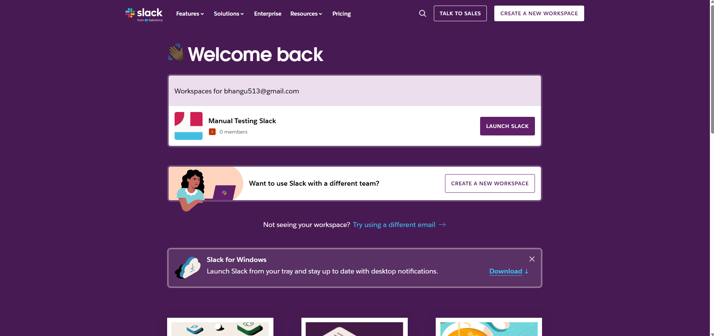
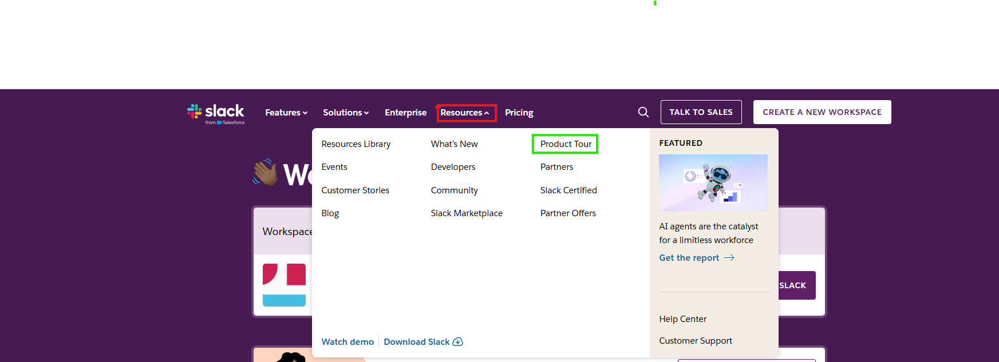
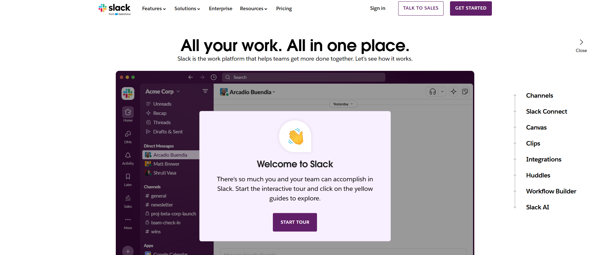

| **Test Case ID** | **Test Scenario**                       | **Test Steps**                                                                                  | **Expected Result**                                                    | **Actual Result** | **Status** |
| ---------------- | --------------------------------------- | ----------------------------------------------------------------------------------------------- | ---------------------------------------------------------------------- | ----------------- | ---------- |
| TC-01            | Validate product tour navigation        | 1. Open Slack homepage 2. Click on "Product" in the main menu 3. Select "Product Tour"          | Product tour page should load correctly                                |  1. Open Slack homepage      2."Click on "Product" in the main menu" There is no click option for "product" in the main menu. The user will have to click on "Resources" to complete this step.      3. Select "Product Tour" The page opens up succesfully       | PASS |
| TC-02            | Verify pricing calculator functionality | 1. Navigate to the pricing page 2. Select different pricing plans 3. Observe the pricing update | Pricing updates accurately                                             | *To be tested*    | Pending    |
| TC-03            | Validate contact form submission        | 1. Navigate to the contact form 2. Fill out all required fields 3. Click "Submit"               | Form should submit without errors, and a success message should appear | *To be tested*    | Pending    |
